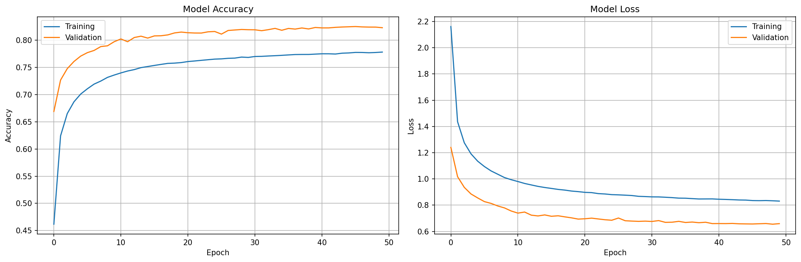

# AI Drawing Classifier API

REST API for real-time hand-drawn sketch recognition using a convolutional neural network trained on the Google Quick Draw! dataset.

## Features

- Custom CNN architecture for sketch classification
- 46 supported drawing categories
- Returns top-3 predictions with confidence scores
- API key authentication
- Rate limiting per endpoint
- Docker and Google Cloud Run deployment support

## Supported Categories

```
airplane, apple, bicycle, bird, book, bus, car, cat, chair, circle,
clock, cloud, computer, cup, dog, elephant, eye, face, fish, flower,
fork, guitar, hand, hat, house, key, knife, leaf, moon, mountain,
mouse, mushroom, pencil, pizza, rainbow, shoe, snake, star, sun,
sword, table, train, tree, truck, umbrella, whale
```

## Quick Start

### Prerequisites

- Python 3.10+
- TensorFlow CPU 2.x

### Installation

```bash
git clone <repository-url>
cd doodleai
pip install -r requirements.txt
```

### Run the API

```bash
AI_API_KEY=your-secret-key python app.py
```

The API will be available at `http://localhost:5000`.

### Run with Docker

```bash
docker build -t doodleai .
docker run -p 8080:8080 -e AI_API_KEY=your-secret-key doodleai
```

Or using Docker Compose:

```bash
AI_API_KEY=your-secret-key docker compose up
```

## API Endpoints

All endpoints (except `/`) require the `x-api-key` header.

### GET /

Returns API metadata and available endpoints.

```json
{
  "name": "AI Drawing Classifier API",
  "version": "1.0",
  "endpoints": {
    "POST /predict": "Classify a drawing image",
    "GET /classes": "Get list of supported classes",
    "GET /health": "Check API health"
  }
}
```

### POST /predict

Classifies a base64-encoded drawing. Rate limit: 10 requests/minute.

Request:
```json
{
  "image": "data:image/png;base64,<base64-encoded-image>"
}
```

Response:
```json
{
  "predictions": [
    {"class": "cat", "confidence": 92.1},
    {"class": "dog", "confidence": 5.3},
    {"class": "bird", "confidence": 1.8}
  ],
  "success": true
}
```

### GET /classes

Returns all supported drawing categories.

### GET /health

Returns API and model status.

### GET /get_random_word

Returns a random category for drawing challenges.

## Usage Example

```python
import requests
import base64

with open('drawing.png', 'rb') as f:
    image_data = base64.b64encode(f.read()).decode()

response = requests.post(
    'http://localhost:5000/predict',
    headers={'x-api-key': 'your-secret-key'},
    json={'image': f'data:image/png;base64,{image_data}'}
)

result = response.json()
print(result['predictions'][0])
```

## Training Your Own Model

Training scripts are in the `scripts/` directory. See `scripts/README.md` for details.

```bash
# 1. Download and preprocess data
python scripts/prepare_data.py

# 2. Train the model
python scripts/train_model.py
```

## Training History



## Technical Details

- **Architecture**: 3-layer CNN with BatchNormalization, GlobalAveragePooling, and data augmentation
- **Input**: 28x28 grayscale images
- **Dataset**: Google Quick Draw! numpy bitmap format
- **Framework**: TensorFlow/Keras
- **Model size**: ~6.4 MB
- **Inference time**: <100ms
- **API**: Flask with rate limiting and CORS

## Running Tests

```bash
AI_API_KEY=test-key pytest tests/ -v
```

## Deployment

The API is designed for Google Cloud Run. The CI/CD workflow in `.github/workflows/deploy-gcp.yml` handles deployment on manual trigger.

Requires environment variables:
- `AI_API_KEY` - API authentication key

## License

MIT License - see LICENSE for details.
